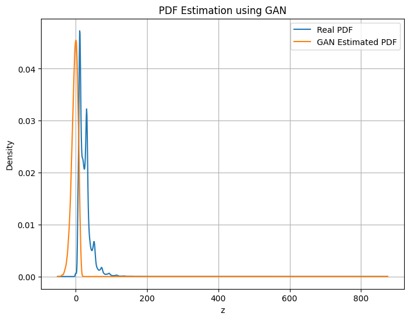

# Learning Probability Density Functions using data only 📊

**Assignment-2**  
**UCS654**

_Submitted by:_  
**Dhruv Kamboj**  
**102303645**  
**3C45**

---

## 🎯 Objective

The objective of this assignment is to **learn an unknown probability density function (PDF)** of a transformed random variable using **data samples only**, without assuming any analytical parametric form.

The task demonstrates:

- Non-linear transformation of real-world data
- Learning a distribution using a Generative Adversarial Network (GAN)
- Density estimation from generated samples

---

## 📥 Dataset

The dataset contains air quality measurements across Indian cities.  
For this assignment, the **NO₂ (Nitrogen Dioxide)** feature is used as the input variable \( x \).

**Dataset Link:**  
https://www.kaggle.com/datasets/shrutibhargava94/india-air-quality-data

---

## 🧩 Problem Formulation

### Step-1: Non-Linear Transformation

Each value of \( x \) is transformed using:

$$
z = x + a_r \sin(b_r x)
$$

Where:

$$
a_r = 0.5 \times (r \bmod 7)
$$

$$
b_r = 0.3 \times ((r \bmod 5) + 1)
$$

and  

r = university roll number (102303645).

### Computed Parameters

For r = 102303645:

- \( a_r = 2.0 \)
- \( b_r = 0.3 \)

---

## 🤖 Step-2: Learning the PDF using GAN

Since no analytical form of the distribution is provided, a **Generative Adversarial Network (GAN)** is used to learn the distribution directly from samples of \( z \).

### GAN Structure

**Generator:**
- Input: Noise vector \( \epsilon \sim N(0,1) \)
- Dense(64) → LeakyReLU  
- Dense(128) → LeakyReLU  
- Dense(1)

**Discriminator:**
- Dense(128) → LeakyReLU  
- Dense(64) → LeakyReLU  
- Dense(1, Sigmoid)

The generator learns to produce fake samples \( z_f \), while the discriminator learns to distinguish real samples from generated ones.

---

## 📊 Step-3: PDF Approximation

After training:

- 50,000 samples were generated from the trained generator.
- Kernel Density Estimation (KDE) was applied to estimate the learned probability density.
- The estimated PDF was compared with the real distribution.

---

## 📈 Output Plot

The following plot compares:

- Real PDF (from transformed data)
- GAN Estimated PDF (from generated samples)

---

## 🔎 Observations

### Mode Coverage
The GAN successfully captures the dominant mode (main peak) of the transformed distribution. However, smaller variations and tail behavior are not fully represented, indicating partial mode coverage.

### Training Stability
Training remained stable up to 65 epochs. Beyond this point, adversarial imbalance caused divergence in the generated distribution. Early stopping improved approximation quality.

### Quality of Generated Distribution
The generated PDF closely matches the central density region of the real distribution. While tail regions are slightly underrepresented, the GAN effectively learns the primary structure of the unknown distribution without assuming any parametric form.

---

## 📝 Conclusion

This assignment demonstrates how a probability density function can be learned **purely from data samples** using a GAN.

Without assuming Gaussian or any other parametric distribution, the model successfully approximated the dominant structure of the transformed variable.

---

## ✅ Key Takeaway

> Generative Adversarial Networks can learn complex probability distributions directly from data without requiring an explicit analytical model.

---

⭐ *This project illustrates data-driven density learning using adversarial training.*
